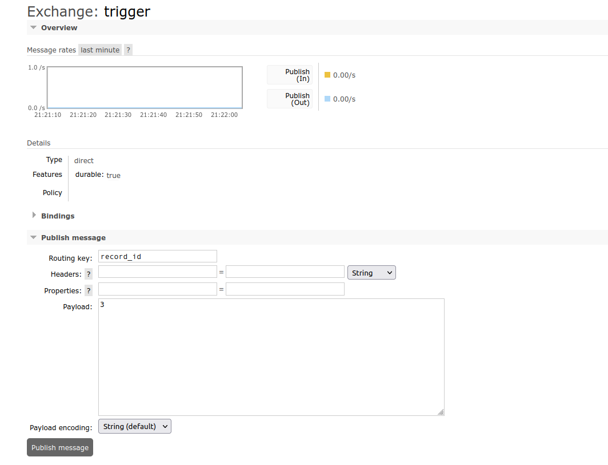
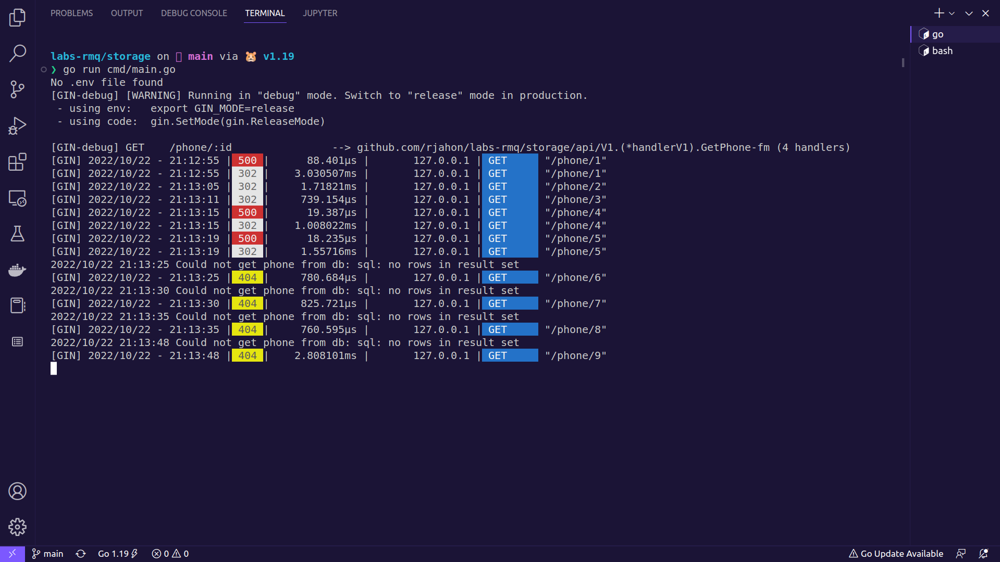
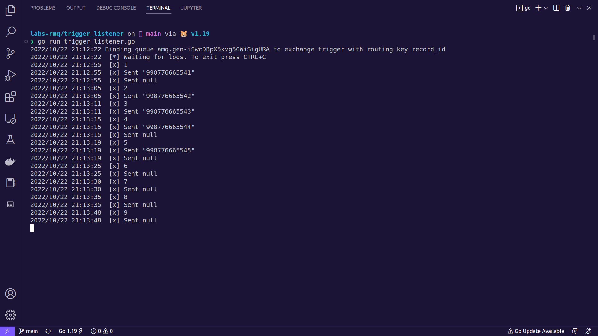
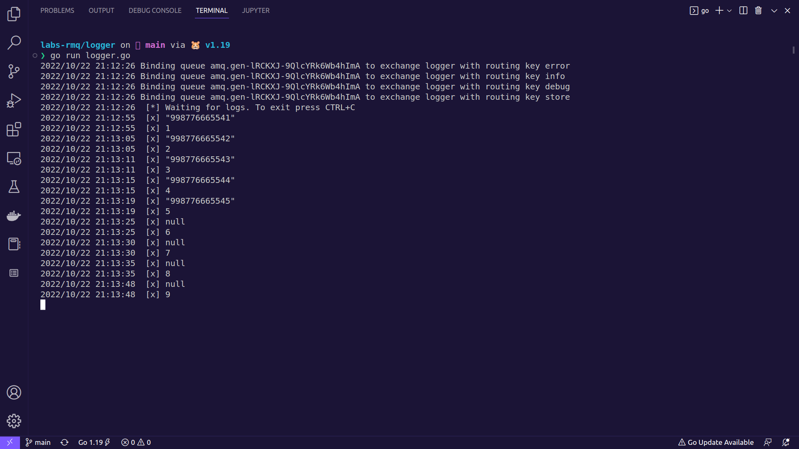

# Labs RabbitMQ

## Special note

- Didn't understand why we would need the 4th consumer in service2/logger, which is supposed to store all sent messages. (Isn't that functionality already implemented by consumer4/debug?)

